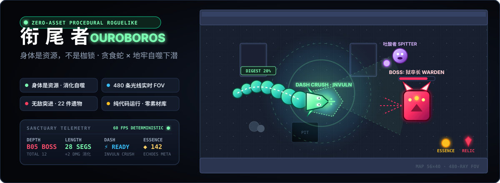

<p align="center">
  
</p>

<p align="center">
  <a href="https://holynova.github.io/ouroboros-rogue-snake/"></a>
  
  
  
  
  <a href="LICENSE"></a>
</p>

<p align="center">
  <b>身体不是移动的枷锁，而是毁灭敌人的锋刃。</b><br>
  一条饥饿的蛇在 12 层深渊地牢中不断下潜。在自噬消化、无敌突进、480 条实时视线光追与循环回响中，打破生与死的衔尾闭环。
</p>

---

## 🎮 在线试玩与移动端直达

- **网页端即刻启程**：[https://holynova.github.io/ouroboros-rogue-snake/](https://holynova.github.io/ouroboros-rogue-snake/)
- **手机扫码即玩**：

<p align="center">
  
</p>

---

## ⚔️ 游戏实机展示

<p align="center">
  
</p>

<p align="center">
  <em>地牢深处：实时 FOV 视线遮挡、2 格宽走廊战术机动、敌人与升级抽卡界面</em>
</p>

---

## 💡 核心设计哲学：身体是资源，不是枷锁

传统贪食蛇的铁律是「长 = 死」——当蛇身长到几十节，狭窄空间内掉头必死无疑。  
**《衔尾者》将此规则彻底倒置：**

| 碰撞与移动事件 | 系统判定结果 | 战术意图 |
| :--- | :--- | :--- |
| **咬到/压到自身** | 扣除 1 点生命，**消化掉 20% 长度，但绝不卡住，继续破浪前行** | 自残脱困，主动缩短身体以换取周旋空间 |
| **撞向墙壁** | 停在原地等待玩家转向输入，蛇身仅踉跄 0.15 个身位 | 消除无意义的撞墙暴毙挫败感 |
| **走入死胡同静止** | 若停滞超过 1.1 秒未移动，触发**强行转身**底层保护 | 确保任何情况下永不发生软锁死（Softlock） |
| **长度转化伤害** | 选修「消化」升级后，身长的 8% 直接折算为常驻伤害加成 | **变长即变强**，长躯既是输出更是防线 |

为配合这一核心规则，游戏中的地牢走廊**一律雕刻为 2 格宽度**，并辅以碎石、深坑与循环回廊，让数十节的巨蛇始终拥有腾挪与包抄的战术空间。

---

## 🌀 深度游戏系统与机制

### 1. 动态战斗体系：撕咬、冲刺与冲击波
- **撕咬撕裂（Bite）**：蛇头接触敌人造成物理撕咬，附带击退效果与粒子爆裂。
- **无敌突进（Dash · 空格键）**：
  - 瞬间向前冲刺多个身位，冲刺期间处于**绝对无敌状态**。
  - 直接碾碎轨迹上的普通敌人并摧毁飞行酸弹，是突围与斩杀精英怪的核心位移技。
- **冲击波震荡（Shockwave · Q 键）**：释放圆环震波，击退周身所有敌人并化解弹幕围困。

### 2. 480 条光线实时投射视野（480-Ray Dynamic FOV）
- **高密度光线追踪**：游戏以 14Hz 频率从蛇头向四周投射 **480 条视线光线**。
- **精准物理遮挡**：光线遇墙体与石柱停止，真实呈现转角死角、开阔大厅的明暗对比。
- **迷雾记忆机制**：走过的房间保留暗调地形轮廓，而敌人、酸弹、拾取物、祭坛与传送门严格遵循视线显隐。

### 3. 敌人生态与 BFS 距离场 AI
系统每 0.4 秒从蛇头位置重新演算全图广度优先搜索（BFS）距离标量场，魔物沿梯度下降逼近：

| 魔物名称 | 英文标识 | 基础生命 | 攻击伤害 | 行为模式与特殊能力 |
| :--- | :---: | :---: | :---: | :--- |
| **蚀爬者 (Crawler)** | 🕷️ | 3 HP | 1 DMG | 直线追踪，闻到鳞片气味扑来的基础猎手 |
| **吐酸者 (Spitter)** | 🟣 | 3 HP | 1 DMG | 保持距离游走（Keep-away），高频喷吐腐蚀弹逼迫走位 |
| **胀爆体 (Bloater)** | 💣 | 4 HP | 2 DMG | 慢速逼近，**死亡时剧烈膨胀并自爆（2.2 格半径 AOE）** |
| **穿墙影 (Wraith)** | 👻 | 2 HP | 1 DMG | **虚化穿墙**，无视任何地牢墙壁阻隔直接抄近道突袭 |
| **腐甲巨仆 (Husk)** | 🛡️ | 9 HP | 2 DMG | 重装步兵，甲壳极厚；击杀后掉落治疗奖励 |
| **狱卒长 (Warden)** | 👹 **BOSS** | **46 HP** | 2 DMG | **第 5 层守门 BOSS**：双格体积，三向扇形弹幕，每 6 秒召唤 2 只蚀爬者 |
| **万象之腹 (Devourer)**| 👁️ **FINAL** | **190 HP** | 3 DMG | **第 12 层终末魔神**：五路密集弹幕，召唤自爆体，考验构筑极限 |

### 4. 肉鸽构筑：24 种升级卡牌 × 22 件遗物
- **升级三选一（Level-up Draft）**：
  - 经验值填满后即时冻结世界，弹出三张随机强化卡牌。
  - 涵盖输出强化（*锐齿、消化、裁决*）、生存防御（*硬壳、虚化、愈合、荆棘鳞*）、机制变异（*相位折叠、灵视、疯长、要害*）。
- **22 件遗物矩阵（Relics）**：
  - 分为白、蓝、金三档稀有度。
  - 提供被动质变，如跨层回血、击杀吸魂、长度上限突破与致命伤免疫（残响）。
- **圣所与回响传承（Sanctuary Meta-Progression）**：
  - 死亡并非终点，探索成果转化为「回响（Echoes）」。
  - 在圣所中解锁永久被动天赋与 5 种起始可选遗物，存档于本地 `localStorage`。

### 5. 极致调校的无损转向缓冲
蛇必须在网格边界执行转向，基础速度 4 格/秒（~250ms 步进）。为杜绝任何吞键与误操作，输入系统采用专门设计的转向语义：
- **同向输入**：自动去重忽略；
- **180° 改主意**：若处于待转向状态，按下相反方向将**直接覆盖待转向**（“我改主意了”），不再机械当做非法输入丢弃；
- **队列满溢策略**：缓冲满时覆盖最后一格，最新意图永远胜出；
- **撞墙过滤**：撞墙时仅剔除直接撞入墙体的方向，侧向移动输入立即响应生效。

---

## 🎨 美术与声效：纯运行时生成的「零素材」奇迹

代码库内**没有引入任何外部图片与音频媒体文件**，全部依靠浏览器原生 API 动态演算：

- **Canvas2D 动态纹理图集 (`src/art.js`)**：
  - 运行时动态生成 8 种地牢瓦片、蛇身/蛇头/分段关节、5 种掉落物与 7 种怪物。
  - 采用灰度母版 + Phaser `tint` 色相着色器，使整条巨蛇沿脊背呈现自翠绿至深青的无缝色相渐变。
- **纯代码 Web Audio 合成器 (`src/audio.js`)**：
  - 16 分音符调度器，实时分层调度贝斯、琶音、环境铺底与打击鼓组。
  - 音乐调式根据探索深度自适应律动跃迁：  
    `Natural Minor` → `Phrygian` → `Dorian` → `Hungarian` → `Lydian` → `Locrian`，并在 BOSS 战爆发高 BPM 紧张编曲。
  - 20 种打击与交互音效全部由振荡器、滤波器包络与白噪声实时调制，经由真实卷积混响管线输出。

---

## 🕹️ 键盘操作指南

| 按键 | 对应动作 | 核心说明 |
| :--- | :--- | :--- |
| <kbd>W</kbd> <kbd>A</kbd> <kbd>S</kbd> <kbd>D</kbd> / 方向键 | **移动与转向** | 智能无损缓冲，支持待转改向 |
| <kbd>Space</kbd> 空格键 | **无敌突进 (Dash)** | 冲刺碾碎路径敌人与弹幕，脱困神技 |
| <kbd>Q</kbd> | **冲击波 (Shockwave)** | 周身范围震退敌人，清除迫近威胁 |
| <kbd>E</kbd> | **环境交互** | 交互祭坛、开启传送门、对话 |
| <kbd>Tab</kbd> | **图鉴 (Bestiary)** | 查看魔物、遗物与升级项详细图鉴 |
| <kbd>Esc</kbd> | **暂停菜单** | 调出系统菜单、查看当前构筑 |

---

## 🛠️ 技术栈与工程架构

```
src/
  ├── main.js          # Phaser 启动、场景状态机、全局快捷键、DOM UI 桥接
  ├── config.js        # 瓦片常量、调色板、深度配置、外部站点链接
  ├── rng.js           # mulberry32 确定性种子随机算法
  ├── dungeon.js       # 2格宽走廊算法、房间连接、BFS 距离场
  ├── run.js           # 单局状态机：数值结算、经验、升级、遗物与精华
  ├── data.js          # 敌人、升级卡牌、遗物全量数值表
  ├── meta.js          # 圣所系统：永久天赋加点与本地存档
  ├── art.js           # 纯代码 Canvas2D 程序化纹理合成
  ├── audio.js         # Web Audio 动态声学生成与调式编曲
  ├── ui.js            # 原生 DOM 界面（HUD、抽卡、图鉴、圣所玻璃拟态）
  └── scenes/
      ├── GameScene.js # 核心玩法场景（固定 1/60s 定长步长）
      └── MenuScene.js # 标题动态背景场景
```

- **开发与构建**：Phaser 3.90 · Vite 8 · 原生 DOM UI
- **物理与逻辑**：严格 60Hz 定长时钟更新，与屏幕刷新率解耦，确保同一种子生成同构地牢
- **自动化测试**：Playwright 端到端测试（30 项自动化用例，涵盖转向语义与逻辑验证）

---

## 🚀 本地开发与测试

```bash
# 安装依赖
npm install

# 启动本地开发热重载服务器 (http://localhost:5173)
npm run dev

# 运行自动化端到端测试与转向语义测试
npm test

# 打包生产环境版本（输出至 docs/）
npm run build

# 本地预览生产构建
npm run preview
```

---

## 📄 开源许可证

本项目基于 [MIT License](LICENSE) 自由开源。  
深入的技术选型与设计取舍请阅读 [DEVELOPMENT.md](DEVELOPMENT.md)。
