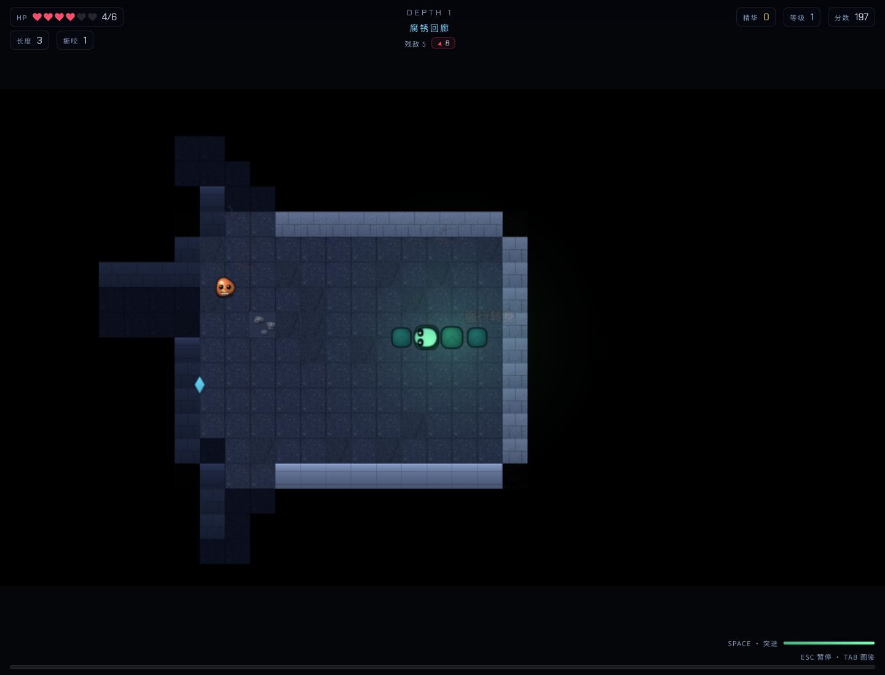

# 衔尾者 · OUROBOROS / Dungeon Snake

贪食蛇与地牢肉鸽结合，以程序化美术、合成音效和遗物构筑呈现浏览器冒险。

A browser snake roguelike with procedural visuals, synthesized audio and relic builds.

[在线体验](https://ouroboros-rogue-snake.xiaosang.cc/) · [源码](https://github.com/holynova/ouroboros-rogue-snake)



## 可以做什么

- 探索地牢、战斗进食与三选一升级。
- 图像与音效由运行时生成，进度保存在本机。

## 怎么玩

WASD转向，Space突进，E交互，Q冲击波，Tab图鉴，Esc暂停。

## 本地运行

```bash
npm ci
npm run dev
# 生成生产产物
npm run build
```

运行 `npm test` 检查已有游戏规则与转向验收。进度保存在本机浏览器，清理站点数据会移除存档。

许可证见 [LICENSE](LICENSE)。


## 发布

```bash
npm run build
npx --yes wrangler@4.128.0 deploy --dry-run --config wrangler.jsonc
npx --yes wrangler@4.128.0 deploy --config wrangler.jsonc
```

从 `master` 同一提交在本地手动发布到Cloudflare Workers。正式地址：[https://ouroboros-rogue-snake.xiaosang.cc/](https://ouroboros-rogue-snake.xiaosang.cc/)。
