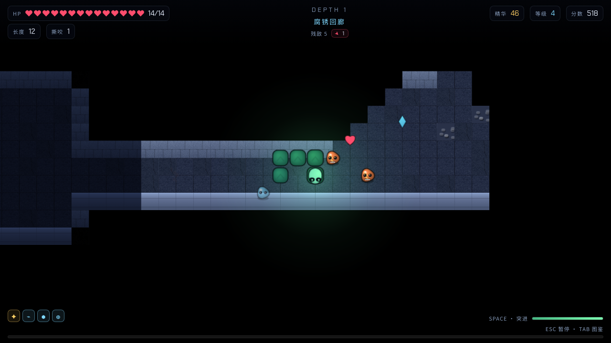

<div align="center">

# 衔尾者 · OUROBOROS

**贪食蛇 × Roguelike · 纯浏览器 · 零素材**

[▶ 在线试玩 (GitHub Pages)](https://holynova.github.io/ouroboros-rogue-snake/)
&nbsp;·&nbsp;
[⭐ 源码 (GitHub)](https://github.com/holynova/ouroboros-rogue-snake)



</div>

---

## 玩法

一条饥饿的蛇在 **12 层程序化地牢**里不断下潜。你不能停下、不能回头，只有不断变长，或者被自己的鳞片消化掉。

- **进食**变长，**撕咬**敌人，**突进**无敌碾碎
- **长度是资源**：压到自己身上会掉血并消化掉 20% 长度，但不会卡住你——所以「长」同时也是伤害来源
- 每层出口默认锁死，**清空敌人**才开；也可以付精华强行突破
- 升级三选一、22 件遗物、7 种敌人、每 5 层一名 BOSS
- 死亡结算「回响」，在**圣所**兑换永久强化

`WASD` 转向 · `SPACE` 突进 · `E` 交互 · `Q` 冲击波 · `TAB` 图鉴 · `ESC` 暂停

## 手机扫码即玩

<div align="center">


`https://holynova.github.io/ouroboros-rogue-snake/`
</div>

## 特点

- **零第三方素材**：所有贴图由 Canvas2D 运行时绘制，配乐与音效由 Web Audio 实时合成，仓库里没有一个图片或音频文件
- **确定性模拟**：固定 1/60 秒步进，同一种子必定生成同一张地图
- **离线可玩**：无后端、无网络请求，进度存在 `localStorage`

## 本地运行

```bash
npm install
npm run dev      # http://localhost:5173
npm run build    # 输出到 docs/（GitHub Pages 目录）
npm test         # 30 项端到端 + 转向语义检查
```

## 技术栈

Phaser 3 · Vite · 原生 DOM UI · Web Audio · Playwright（测试）

MIT License · 详细设计见 [DEVELOPMENT.md](DEVELOPMENT.md)
